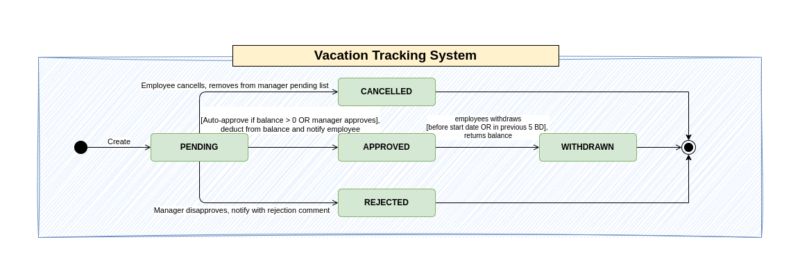
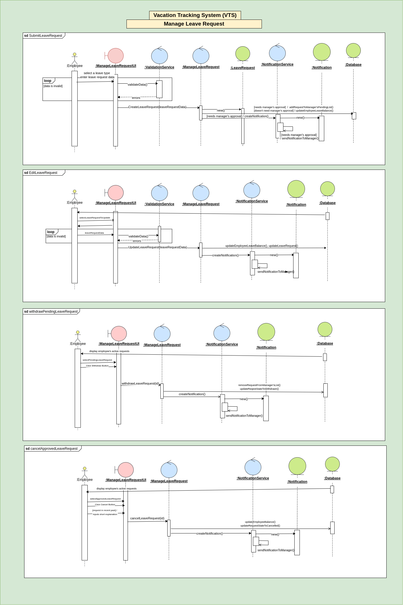
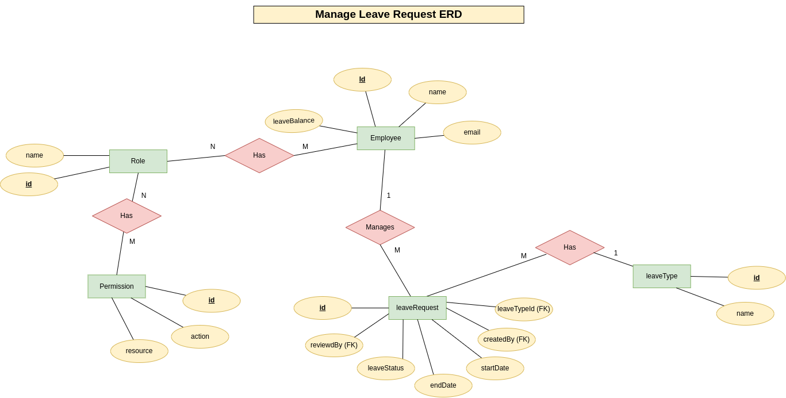
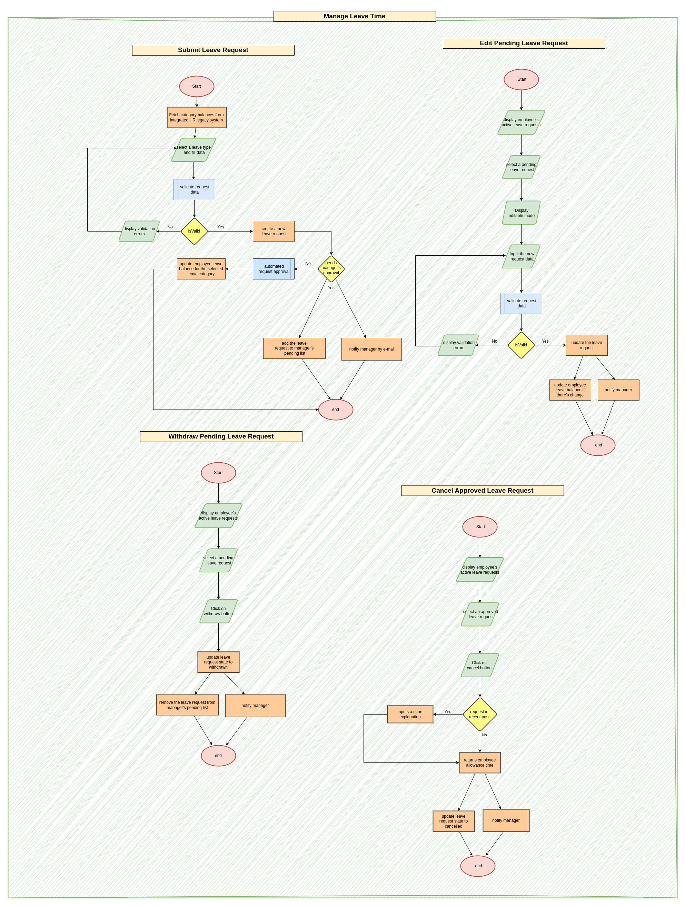
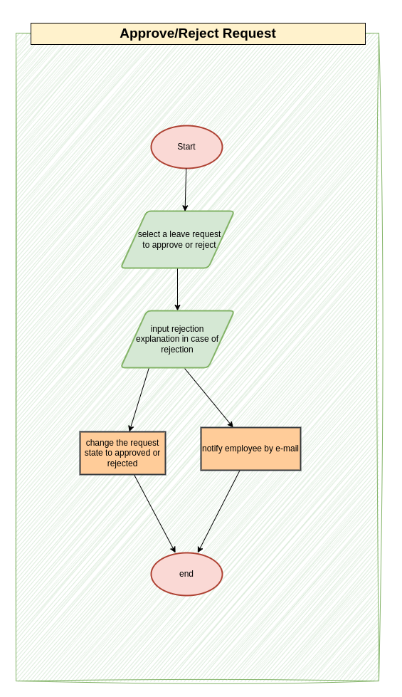
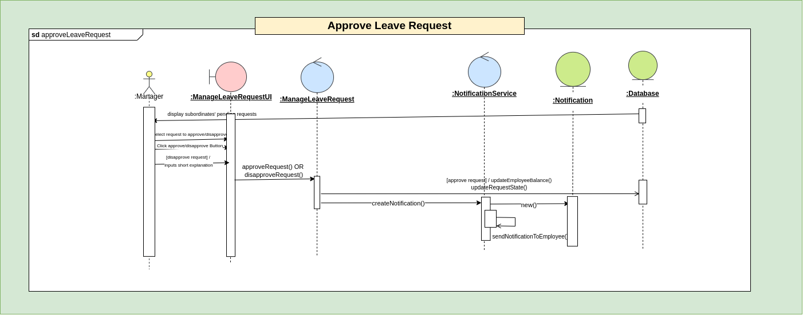

# 🌴 Vacation Tracking System

This project is based on the system described in the textbook  
**"Object-Oriented Analysis and Design with Applications" – 3rd Edition**.

The goal is to design and analyze a **Vacation Tracking System** that allows employees to manage leave requests and enables HR and managers to track and act on them efficiently.

---

## 📌 Table of Contents

- [🌴 Vacation Tracking System](#-vacation-tracking-system)
  - [📌 Table of Contents](#-table-of-contents)
  - [🧠 Problem Definition](#-problem-definition)
  - [👓 Vision](#-vision)
  - [📋 Requirements](#-requirements)
    - [Functional requirements (FR):](#functional-requirements-fr)
    - [Non-Functional Requirements (NFR):](#non-functional-requirements-nfr)
  - [🛠 Constraints](#-constraints)
  - [🧠 Requirements Analysis \& Design](#-requirements-analysis--design)
    - [1. Use Case Diagram](#1-use-case-diagram)
    - [2. Views](#2-views)
    - [3. State Machine Diagram For A Leave Request](#3-state-machine-diagram-for-a-leave-request)
    - [3. Use Cases designs](#3-use-cases-designs)
  - [📄 Use Case Specifications](#-use-case-specifications)
  - [🛠 Technologies](#-technologies)
  - [📚 References](#-references)
---

## 🧠 Problem Definition
Organizations struggle and consume a significant amount of time managing employees leave requests, and it can take days for a leave request to be reviewed and acted upon, causing delays. To address this challenge, an automated vacation tracking system is essential to automate and accelerate this process while saving time and reducing frustration for both employees and the HR team.
## 👓 Vision
A vacation tracking system will provide the employees with an easy way to manage their own vacation time, sick leave without having to be an expert in the company policies. It will help managers track their employees' vacations and availability.
## 📋 Requirements
### Functional requirements (FR): 
1. Employees can submit a leave request with desired start and end date.  
2. Managers (approvers) can approve or reject leave requests, with the option to provide a reason for rejection.  
3. The system must support a fully automated workflow for processing leave requests based on organizational policies.  
4. Employees can view their own leave balance.  
5. HR users can access any relevant data for any employee, including leave balance, leave history, etc.  
6. The system must integrate with external HR systems to retrieve employees data for automated workflows.
7. The system must have an email notification mechanism to:  
    - inform employees when their request is approved/rejected  
    - notify managers (approvers) of pending requests
8. The HR team can manually override rules in special cases (e.g., emergencies or out-of-policy requests).  
9.  The system must track audit logs of leave requests and approvals for accountability and compliance.  
10. The system must allow managers to directly award personal leave time (with system-set limits).  
11. The HR team can update the system leave policies.  

### Non-Functional Requirements (NFR): 
1. The system must be easy to use, with a clean and intuitive UI for both employees and HR/manager users.
2. Employees must be able to access only their own data; access to other employees’ data must be restricted according to roles and permissions.
3. The system must be accessible on both desktop and mobile devices.
4. The system must uses an existing hardware and middleware .
5. The system must ensure role-based access control (RBAC) for different user types (employees, managers, HR).

---

## 🛠 Constraints
1. Is implemented as an extension to the existing intranet portal system, and
uses the portal’s single-sign-on mechanisms for all authentication.
2. The system must work on both mobile and desktop devices with a responsive design.
3. The system UI must match with the existing portal design rules and guides

## 🧠 Requirements Analysis & Design

### 1. Use Case Diagram
  

### 2. Views
  

### 3. State Machine Diagram For A Leave Request
  

### 3. Use Cases designs

  
<strong>Manage Leave Request</strong>

   

  

    
<strong>Sequence Diagram</strong>

     
    
  

   

  

    
<strong>ER Diagram</strong>

     
    
  

   

  

    
<strong>Flow Chart</strong>

     
    
  

   

  

    
<strong>Pseudocode for the four operations (submit/cancel/withdraw/edit)</strong>

     
    <a href="./manageLeaveRequestPseudocode.md">View Pseudocode</a>
  

 

  
<strong>Approve Request</strong>

  

    
<strong>Flow Chart</strong>

     
    
  

  

    
<strong>Sequence Diagram</strong>

     
    
  

  
   

    
<strong>Pseudocode</strong>

     
    <a href="./approveRequestPseudocode.md">View Pseudocode</a>
  

## 📄 Use Case Specifications

| Use Case                                                                | Description                                    |
| ----------------------------------------------------------------------- | ---------------------------------------------- |
| [`Submit Leave Request`](use-cases-specification/ManageLeaveRequest.md) | Employee submits/cancels/edits a leave request |

---

## 🛠 Technologies

- UML tools: draw.io
- Markdown for documentation

---

## 📚 References

- *Object-Oriented Analysis and Design with Applications*, 3rd Ed – Grady Booch et al.