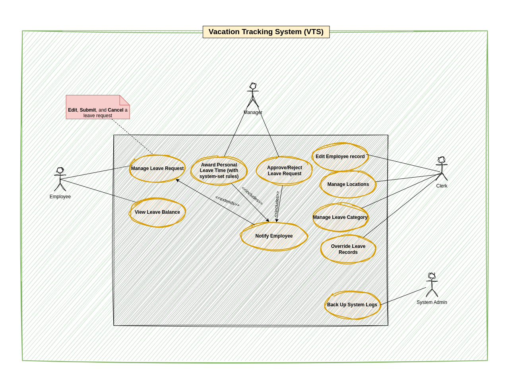
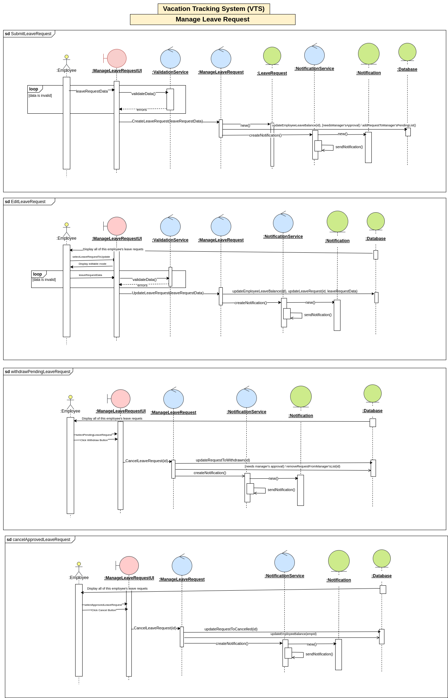
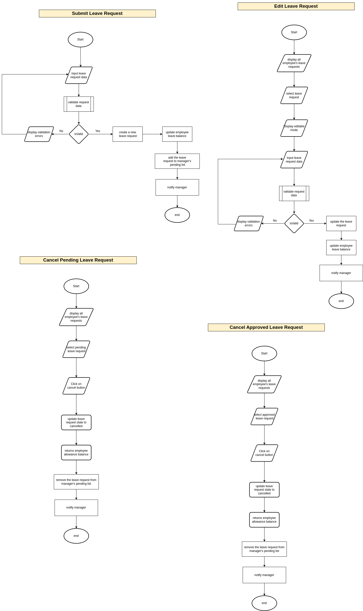

# 🌴 Vacation Tracking System

This project is based on the system described in the textbook  
**"Object-Oriented Analysis and Design with Applications" – 3rd Edition**.

The goal is to design and analyze a **Vacation Tracking System** that allows employees to manage leave requests, and enables HR and managers to track and act on them efficiently.

---

## 📌 Table of Contents

- [🌴 Vacation Tracking System](#-vacation-tracking-system)
  - [📌 Table of Contents](#-table-of-contents)
  - [🧠 Problem Definition](#-problem-definition)
  - [👓 Vision](#-vision)
  - [📋 Requirements](#-requirements)
    - [Functional requirements (FR):](#functional-requirements-fr)
    - [Non Functional Requirements (NFR):](#non-functional-requirements-nfr)
  - [🛠 Constrains](#-constrains)
  - [🧠 Requirements Analysis \& Design](#-requirements-analysis--design)
    - [1. Use Case Diagram: visual representation of system functionality from the user's point of view.](#1-use-case-diagram-visual-representation-of-system-functionality-from-the-users-point-of-view)
    - [2. Class Diagram](#2-class-diagram)
    - [3. Use Case-Specific Designs](#3-use-case-specific-designs)
      - [Sequence Diagram](#sequence-diagram)
      - [Flow Chart](#flow-chart)
  - [📄 Use Case Specifications](#-use-case-specifications)
  - [🛠 Technologies (Optional Section)](#-technologies-optional-section)
  - [📚 References](#-references)
---

## 🧠 Problem Definition
Organizations struggle and consumes a bulk of time to manage employees leave requests, and it can take days for a leave request to be reviewed and acted upon, causing delays. To address this challenge, an automated vacation tracking system is essential to automate and speed up this process alongside saving the time and headache for both employees and the HR team.
## 👓 Vision
A vacation tracking system will provide the employee with a handful way to manage their own vacation time, sick leaves without having to be an expert in the company policies, It will help managers track their employees vacations and availability.
## 📋 Requirements
### Functional requirements (FR): 
1. Employees can submit a leave request with desired start and end date.  
2. Managers (approvers) can approve or reject leave requests, with the option to provide a reason for rejection.  
3. The system must support a fully automated workflow for processing leave requests based on organizational policies.  
4. The system must support automatic approval for certain types of leave or under defined conditions (e.g., short duration, sufficient balance).  
5. Employees can view his/her own leave balance.  
6. HR users can access any relevant data for any employee, including leave balance, carryovers, leave history, etc.  
7. The system must integrate with external HR systems to retrieve employee data which informs automatic workflows.  
8. The system must have a notification mechanism (e.g., email, in-app) to:  
    - inform employees when their request is approved/rejected  
    - alert employees about upcoming end-of-leave  
    - notify managers (approvers) of pending requests  
9. The HR team can manually approve or reject requests in special cases (e.g., emergencies or out-of-policy requests).  
10. The system must support special leave types, such as maternity/paternity leave, with manual intervention by HR.  
11. The system must allow **report generation** for HR (e.g., department-level leave trends, unused leave statistics).  
12. The system must **check for conflicts or overlaps**, such as multiple team members requesting leave at the same time.  
13. The system must track audit logs of leave requests and approvals for accountability and compliance.  
14. The system must allow managers to directly award personal leave time (with system-set limits).  
15. The HR team can update the system leave policies.  

### Non Functional Requirements (NFR): 
1. The system must be easy to use, with a clean and intuitive UI for both employees and HR/manager users.
2. Employees must be able to access only their own data; access to other employees’ data must be restricted according to roles and permissions.
3. The system must support at least 100 concurrent users without performance degradation.
4. The system must ensure 99% uptime.
5. The system must be accessible on both desktop and mobile devices.
6. The system must ensure role-based access control (RBAC) for different user types (employees, managers, HR).

---

## 🛠 Constrains
1. The system must not exceed the defined budget and timeline
2. The system must ensure 99% uptime.
3. The system must support at least 100 concurrent users without performance degradation.
4. The system must work on both mobile and desktop with responsive design
5. All access and changes to leave data must be logged.
6. Must comply with different regional leave policies and employment contracts.

## 🧠 Requirements Analysis & Design

### 1. Use Case Diagram: visual representation of system functionality from the user's point of view.
  

### 2. Class Diagram
- Structured object model showing relationships.

### 3. Use Case-Specific Designs
**Use Case: Manage Leave Request**  
#### Sequence Diagram 
  
#### Flow Chart 
  

---

## 📄 Use Case Specifications

| Use Case | Description |
|----------|-------------|
| [`Submit Leave Request`](use-cases/ManageLeaveRequest.md) | Employee submits/cancels/edits a leave request |

---

## 🛠 Technologies (Optional Section)

- UML tools: draw.io
- Markdown for documentation
- GitHub for version control

---

## 📚 References

- *Object-Oriented Analysis and Design with Applications*, 3rd Ed – Grady Booch et al.
